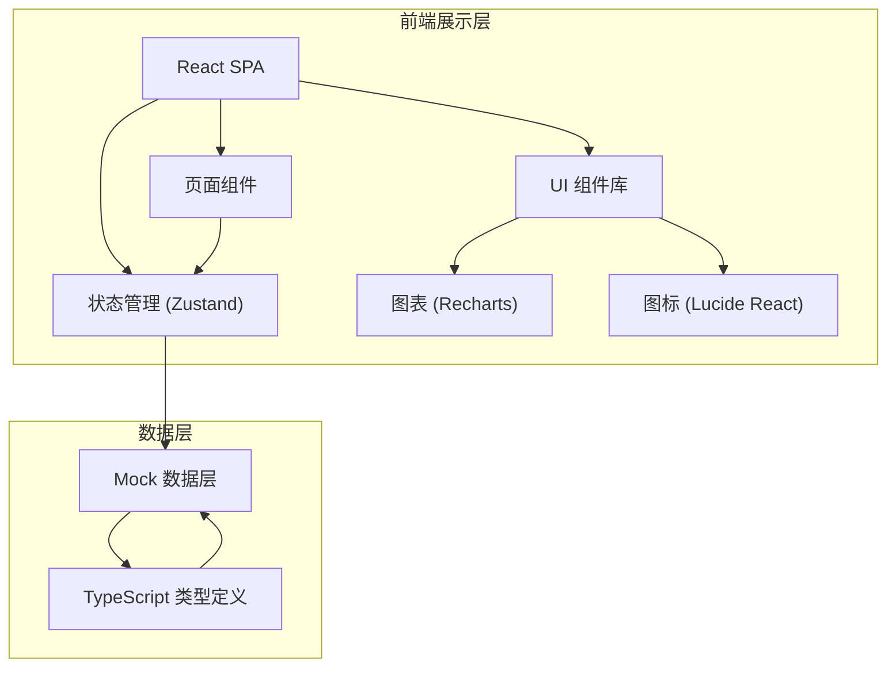
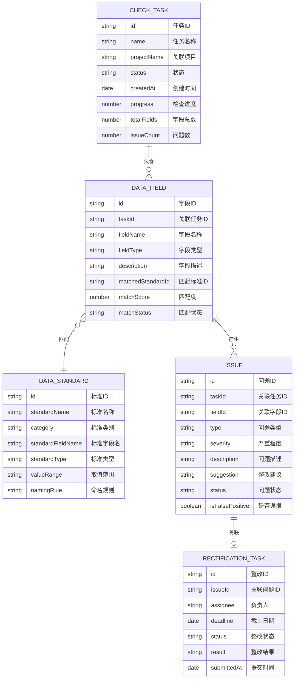

## 1. 架构设计



## 2. 技术描述

- **前端框架**: React@18 + TypeScript + Vite
- **样式方案**: TailwindCSS@3
- **状态管理**: Zustand
- **路由管理**: React Router DOM
- **图表库**: Recharts
- **图标库**: Lucide React
- **初始化工具**: vite-init
- **后端**: 无后端，使用 Mock 数据模拟
- **数据持久化**: 浏览器 localStorage（可选）

## 3. 路由定义

| 路由 | 页面 | 用途 |
|------|------|------|
| `/` | 检查任务 | 检查任务列表与管理首页 |
| `/tasks` | 检查任务 | 任务列表、新建任务、任务详情 |
| `/matching` | 字段匹配 | 字段上传、标准选择、匹配确认 |
| `/issues` | 问题清单 | 问题列表、分类筛选、整改建议 |
| `/rectification` | 整改跟踪 | 任务派发、进度跟踪、结果审核 |
| `/analytics` | 统计分析 | 达标率、违规分布、明细导出 |

## 4. 数据模型

### 4.1 数据模型定义



### 4.2 类型定义

```typescript
interface CheckTask {
  id: string;
  name: string;
  projectName: string;
  status: 'pending' | 'running' | 'completed' | 'archived';
  createdAt: string;
  progress: number;
  totalFields: number;
  issueCount: number;
  standardCategories: string[];
}

interface DataField {
  id: string;
  taskId: string;
  fieldName: string;
  fieldType: string;
  description: string;
  matchedStandardId?: string;
  matchScore: number;
  matchStatus: 'pending' | 'confirmed' | 'rejected';
  tableName?: string;
}

interface DataStandard {
  id: string;
  standardName: string;
  category: string;
  standardFieldName: string;
  standardType: string;
  valueRange: string;
  namingRule: string;
  description: string;
}

type IssueType = 'naming' | 'datatype' | 'valuerange' | 'other';
type IssueSeverity = 'high' | 'medium' | 'low';
type IssueStatus = 'open' | 'rectifying' | 'resolved' | 'falsepositive';

interface Issue {
  id: string;
  taskId: string;
  fieldId: string;
  fieldName: string;
  type: IssueType;
  severity: IssueSeverity;
  description: string;
  suggestion: string;
  status: IssueStatus;
  standardName?: string;
  createdAt: string;
}

type RectificationStatus = 'pending' | 'in_progress' | 'submitted' | 'approved' | 'rejected';

interface RectificationTask {
  id: string;
  issueId: string;
  issueDescription: string;
  assignee: string;
  assigneeAvatar?: string;
  deadline: string;
  status: RectificationStatus;
  result?: string;
  submittedAt?: string;
  createdAt: string;
  priority: 'high' | 'medium' | 'low';
}
```
