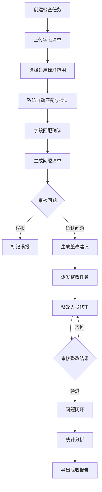

## 1. 产品概述

数据标准落地检查 Web 应用，供数据治理人员验证项目字段是否符合统一数据标准。系统通过自动化检查与人工复核相结合的方式，帮助企业实现数据标准化治理，提升数据质量。

- 主要解决：项目字段命名不统一、数据类型不一致、取值范围不合规等数据标准落地问题
- 目标用户：数据治理专员、数据架构师、项目质量管理人员
- 产品价值：提高数据标准检查效率、降低人工核对成本、确保项目数据合规交付

## 2. 核心功能

### 2.1 用户角色

| 角色 | 注册方式 | 核心权限 |
|------|----------|----------|
| 数据治理人员 | 系统内创建 | 全部功能权限，包括创建任务、派发整改、导出报告 |
| 项目整改人员 | 系统内创建 | 查看整改任务、提交整改结果 |

### 2.2 功能模块

1. **检查任务**：任务列表、新建任务、任务详情、任务状态管理
2. **字段匹配**：字段上传、标准范围选择、自动匹配、疑似匹配展示、人工确认
3. **问题清单**：问题列表、问题分类、标记误报、批量操作、整改建议生成
4. **整改跟踪**：整改任务派发、进度跟踪、结果审核、修正结果验证
5. **统计分析**：项目达标率、违规分布统计、趋势分析、明细导出

### 2.3 页面详情

| 页面名称 | 模块名称 | 功能描述 |
|----------|----------|----------|
| 检查任务 | 任务列表卡片 | 展示所有检查任务，支持搜索、筛选、排序 |
| 检查任务 | 新建任务表单 | 填写任务名称、关联项目、选择标准范围、上传字段清单 |
| 检查任务 | 任务详情面板 | 展示任务基本信息、检查进度、问题统计 |
| 字段匹配 | 上传区域 | 支持 Excel/CSV 拖拽上传待检查字段清单 |
| 字段匹配 | 标准范围选择 | 树形结构选择适用的数据标准范围 |
| 字段匹配 | 匹配结果列表 | 自动展示疑似匹配项，支持匹配度排序、人工确认匹配关系 |
| 问题清单 | 问题分类标签页 | 按命名规范、数据类型、取值范围分类展示问题 |
| 问题清单 | 问题操作区 | 支持标记误报、生成整改建议、批量操作 |
| 问题清单 | 问题详情抽屉 | 展示问题详情、标准对比、整改建议 |
| 整改跟踪 | 整改任务列表 | 展示派发的整改任务、负责人、截止日期、状态 |
| 整改跟踪 | 任务派发表单 | 选择问题、指定负责人、设置截止日期 |
| 整改跟踪 | 整改审核区 | 审核整改结果，通过或驳回 |
| 统计分析 | 达标率仪表盘 | 展示项目整体达标率、趋势图表 |
| 统计分析 | 违规分布图 | 按标准类别展示违规分布柱状图/饼图 |
| 统计分析 | 明细导出 | 支持导出检查明细 Excel 供项目验收 |

## 3. 核心流程

用户创建检查任务并上传待检查字段清单，系统自动匹配数据标准并识别问题；数据治理人员在字段匹配页面确认匹配关系，在问题清单中审核问题、标记误报、生成整改建议；确认的问题派发给整改人员进行修正，整改结果经过审核后更新状态；最终通过统计分析页面查看达标情况并导出验收报告。

## 4. 用户界面设计

### 4.1 设计风格

- **主色调**：专业深蓝色 `#1e3a5f`，体现数据治理的专业性和可信度
- **辅助色**：成功绿 `#10b981`、警告橙 `#f59e0b`、危险红 `#ef4444`，用于状态标识
- **背景色**：浅灰渐变背景，营造干净专业的数据氛围
- **按钮风格**：圆角 6px，带细微阴影，hover 状态有轻微上浮动效
- **字体**：使用 "Plus Jakarta Sans" 作为展示字体，"Noto Sans SC" 作为中文正文字体，字号层次分明
- **布局风格**：顶部导航 + 侧边栏双导航结构，内容区采用卡片式布局
- **图标风格**：使用 Lucide React 图标库，线条风格统一

### 4.2 页面设计概述

| 页面名称 | 模块名称 | UI 元素 |
|----------|----------|---------|
| 检查任务 | 任务列表卡片 | 网格布局卡片，展示任务名称、状态徽章、进度条、统计数字，hover 卡片上浮效果 |
| 检查任务 | 新建任务模态框 | 分步表单设计，带进度指示器，表单字段带图标和说明文字 |
| 字段匹配 | 上传区域 | 虚线边框拖拽区，带上传图标动画，文件拖入时边框变色高亮 |
| 字段匹配 | 标准选择树 | 可折叠树形结构，带复选框，选中项高亮显示 |
| 字段匹配 | 匹配结果表格 | 斑马纹表格，匹配度用进度条+数字展示，待确认行带闪烁提示 |
| 问题清单 | 分类标签页 | 胶囊式标签，带问题数量徽章，切换时带平滑过渡动画 |
| 问题清单 | 问题列表 | 左侧列表+右侧抽屉详情布局，列表项hover背景变化，选中项左侧显示色条 |
| 整改跟踪 | 任务看板 | 按状态分列的看板视图，任务卡片支持拖拽，带负责人头像和截止日期 |
| 统计分析 | 仪表盘 | 大号数字展示核心指标，带趋势箭头和同比变化，图表带渐变色填充 |
| 统计分析 | 图表区 | 响应式图表网格，柱状图和饼图并列展示，鼠标悬停显示数据提示 |

### 4.3 响应式设计

- 采用桌面优先设计，最小适配宽度 1280px
- 侧边栏在窄屏下可折叠为图标模式
- 表格支持横向滚动
- 图表容器自适应宽度
